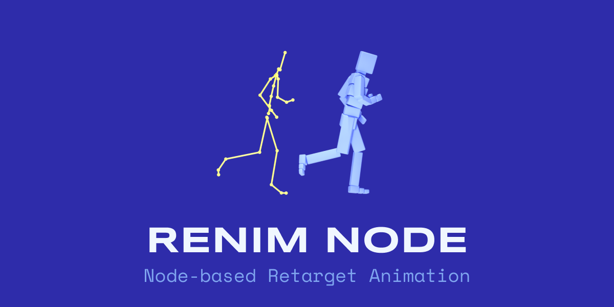
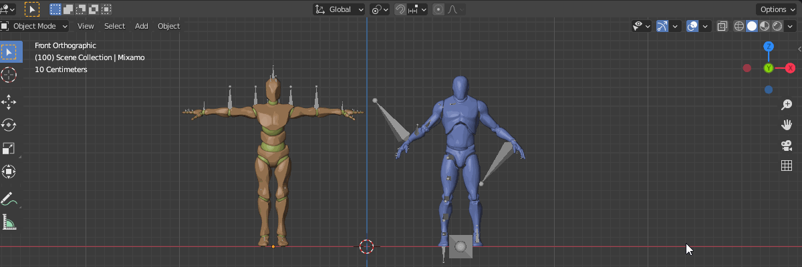
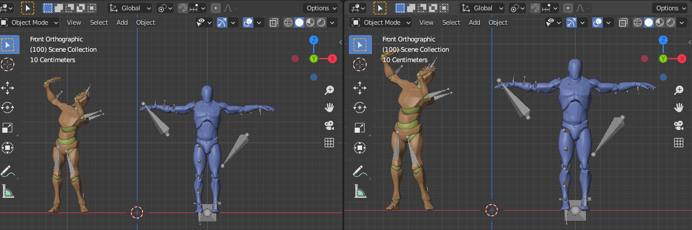
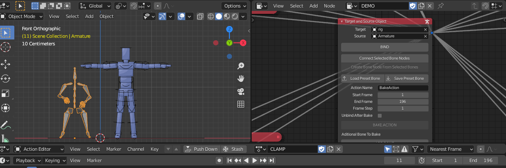

# ReNim Node

- Blender add-on allow you to retarget any animation to bone or bone control.
- Very good for retarget any motion capture animation to any rig.
- No worry about bone orientation and scale.
- The purpose is to retarget animation and clean up action with **NLA Editor**

## Current Version : 0.0.1

## Feature

- Mapping bone on the fly.
- Easy tweak.
- Preset.
- Bake animation.

## Origin

Retarget system originally from my previous project **[Blender UE4 Workspace](https://github.com/anasrar/Blender-UE4-Workspace)** for my retargeting custom rig for Unreal Engine in Blender [**[Github Issues](https://github.com/anasrar/Blender-UE4-Workspace/issues/14#issuecomment-670843204)**]

## Available On

- Gumroad : https://gum.co/renim
- Github : https://github.com/anasrar/ReNim/releases

## Installation

Edit  🡆  Preferences  🡆  Add-ons  🡆  Install  🡆  Select **ReNimNode.zip** 🡆  Install Add-ons.

## How To Use

### Match Pose

Match the **Target** armature to **Source** armature rest of pose.

E.G : Mixamo using  t-pose and Unreal Engine Mannequin using a-pose.

**NOTE** : Armature target and source must have same rotation, Mixamo armature come with rotation offset, you can apply the rotation by **CTRL+A**  🡆  **Rotation**

### Editor Type

Change editor type to **Retarget Animation Node**.

### Mapping Bone

New  🡆  Add  🡆 Object  🡆  **Target And Source Object**  🡆  Fill Target And Source  🡆  Select Target And Source Armature  🡆  Change Mode To **Pose**  🡆  Select The Bone Target First And Then Select The Source Bone 🡆  **Create Bone Node From Selected Bones**  🡆  Change Mode To **Object**  🡆  **BIND**.

**NOTE** : You can mapping bone when the object node is binding.

### Bake Action

Change Mode To **Object** 🡆 **BAKE ACTION**

**NOTE** :

- You can add additional bone to bake
- You need **UNBIND** to view baked action

## Preset

### Save

You can save current bone nodes to JSON file and reuse it.

### Load

You can load bone nodes from JSON file.

## Compatibility Test
- 2.83+
- 2.9+

## Support

You can support me through Gumroad

any donation will be appreciated.

## Contributing

For major changes or features request, please open an issue first to discuss what you would like to change or add.

## Changelog

Any changelog in [Blender Artists Community Post](https://blenderartists.org/t/renim-node-based-retarget-animation/1261958) 

## License

This project is licensed under the **GPL-3.0** License - see the [LICENSE](LICENSE) file for details